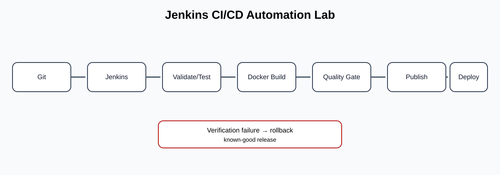

# Jenkins CI/CD Automation Lab

A recruiter-ready DevOps portfolio project showing how a production-style Jenkins delivery workflow can validate code, build an immutable Docker image, apply quality controls, publish artifacts, deploy to an environment, verify the release, and retain a rollback path.

## What this demonstrates

- Jenkins Declarative Pipeline
- CI validation and automated testing
- Docker image creation
- Quality-gate integration point for SonarQube
- Artifact publication integration point for Nexus
- Environment promotion controls
- Deployment verification and rollback pattern
- Python-based pipeline reporting
- GitHub Actions repository validation

## Architecture



Detailed design: [docs/architecture.md](docs/architecture.md)

## Pipeline flow

`Git Push -> Jenkins -> Validate -> Test -> Build -> Quality Gate -> Publish -> Deploy -> Verify -> Rollback (if required)`

The repository intentionally uses generic configuration and integration points. No credentials, internal URLs, or proprietary source code are included.

## Repository structure

| Path | Purpose |
|---|---|
| `Jenkinsfile` | Declarative CI/CD workflow |
| `docker/` | Container build definition |
| `scripts/validate.sh` | Local validation helper |
| `scripts/verify.sh` | Deployment verification helper |
| `scripts/deploy.sh` | Deployment/rollback pattern |
| `scripts/report.py` | Pipeline reporting example |
| `.github/workflows/validate.yml` | Repository-level validation |
| `docs/architecture.md` | Architecture and production-hardening notes |
| `docs/architecture.svg` | Visual architecture diagram |

## How to run

### Local validation

On Linux/macOS:
```bash
chmod +x scripts/*.sh
./scripts/validate.sh
```

On a Jenkins agent, configure the repository as Pipeline-as-Code and point Jenkins to `Jenkinsfile`.

### Docker

Build the sample workload:
```bash
docker build -t jenkins-cicd-lab ./docker
```

Run the image:
```bash
docker run --rm jenkins-cicd-lab
```

## Production implementation

For a real enterprise implementation, connect Jenkins Credentials to SCM, SonarQube, Nexus/registry and deployment targets. Add vulnerability scanning, SBOM generation, approval gates and observability without committing secrets to Git.

## Skills demonstrated

**Jenkins · CI/CD · Declarative Pipeline · Docker · Git · Linux · Shell · Python · SonarQube integration · Nexus integration · Release verification · Rollback design · GitHub Actions**
